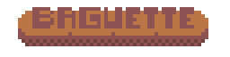

  

<h2 align="center">🥖🥖A  simple 2d rust game engine i did in my spare time🥖🥖</h2>

## Roadmap

- [x] Input
    - [x] Keyboard
    - [x] Mouse
    - [ ] Controller
          
- [ ] Audio player
    - [x] basic playback
          
- [ ] Rendering
    - [x] 3d Camera
       - [x] Translation
       - [x] Orientation with Quaternions
       - [x] Zooming
       - [x] Perspective / Orthographic
       - [ ] .

    - [x] Sprite Rendering
       - [x] Gpu instancing
       - [x] SpriteSheet Animations
    - [x] Fullscreen
    - [x] Screen Resizing
    - [x] Window Icon
        
- [x] Egui integration

- [ ] Coroutines
- [ ] Tweening

## If you are looking for rust game engines..
🚨 NB: if you are looking for mature and stable game engines rust is not the correct place,
all of them are still in their infancy although they are promising engines worth trying. 🚨

- [Bevy](https://github.com/bevyengine/bevy) - The bevy engine
- [Macroquad](https://github.com/not-fl3/macroquad) - is a simple and easy to use game library for Rust programming language, heavily inspired by raylib.

## License

MIT, Apache 2.0

---

> GitHub [Geemba](https://github.com/Geemba)

